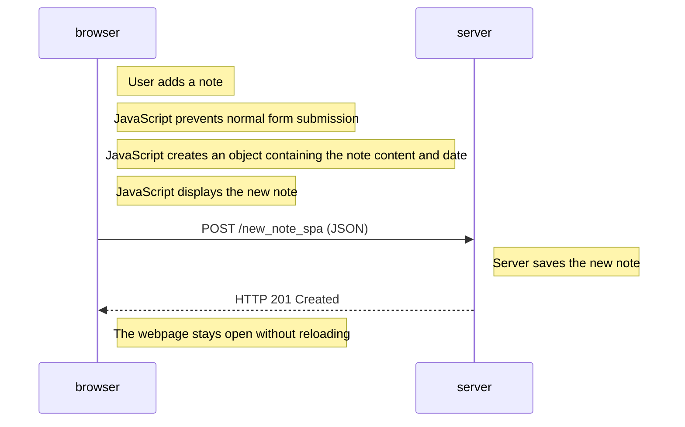

```mermaid

sequenceDiagram
participant browser
participant server

Note right of browser: User adds a note
Note right of browser:JavaScript prevents normal form submission
Note right of browser: JavaScript creates an object containing the note content and date
Note right of browser: JavaScript displays the new note
browser->>server: POST /new_note_spa (JSON)
Note right of server: Server saves the new note
server-->>browser: HTTP 201 Created
Note right of browser: The webpage stays open without reloading

```
